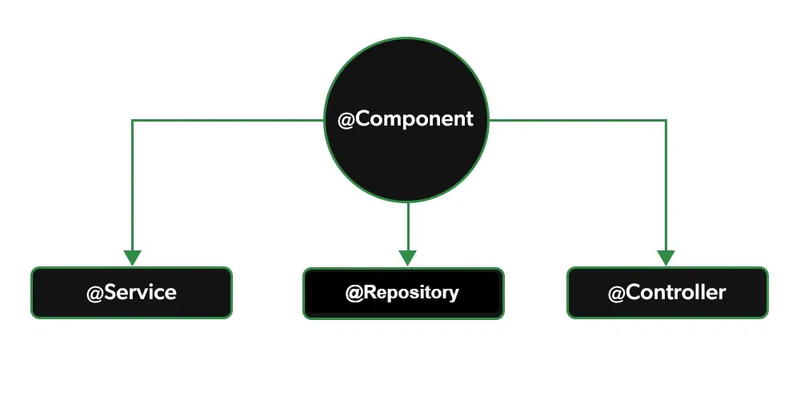

# Annotation based Configuration
By default, spring will not detect the annotation you have used in your application.
To make the Spring configuration file recognise the annotations, you have to use either
`<context:annotation-config />` tag or `<context:component-scan />`<br>

## Configuration file details
`component-scan`: <br>
Scans the classpath for annotated components that will be auto-registered as Spring beans.<br>

## Spring Framework Stereotype Annotations
By default, the Spring-provided <br>
@Component,<br>
@Repository,<br>
@Service,<br>
@Controller,<br>
@RestController,<br>
@ControllerAdvice,<br>and
@Configuration stereotypes will be detected.

```xml
<?xml version="1.0" encoding="UTF-8"?>
<beans xmlns="http://www.springframework.org/schema/beans"
       xmlns:xsi="http://www.w3.org/2001/XMLSchema-instance"
  --=> xmlns:context="http://www.springframework.org/schema/context"
       xsi:schemaLocation="http://www.springframework.org/schema/beans http://www.springframework.org/schema/beans/spring-beans.xsd http://www.springframework.org/schema/context https://www.springframework.org/schema/context/spring-context.xsd">
        
  --=> <context:component-scan base-package="package1, package2,..."></context:component-scan>
</beans>
```

### `@Component` Annotation
<br>
`@Component` is a generic **class-level** annotation that is used to denote a **class** as a Spring component.
You can use this annotation anywhere in the application to mark the beans as Spring's managed component.
As a result, `@Component` can represent any object in the Spring application, including services and controllers.<br>
`@Component` is used in conjunction with `@Autowired` and `@Qualifier` to inject dependencies.<br>

#### [Quoted from Spring API](https://docs.spring.io/spring-framework/docs/current/javadoc-api/org/springframework/stereotype/Component.html)
"Other class-level annotations may be considered as identifying a component as well, typically a special kind of component — for example, the `@Repository`<br>
Any annotation meta-annotated with `@Component` is considered a stereotype annotation which makes the annotated class eligible for classpath scanning. For example, `@Service`, `@Controller`, and `@Repository` are stereotype annotations.
Stereotype annotations may also support configuration of a logical component name by overriding the value() attribute of this annotation via `@AliasFor`."

### `@Autowired` Annotation for DI
It used for automatic dependencies injection(DI) into component class. This annotation can be used with setter method
or with a constructor. It is not recommended to use `@Autowired` with filed injection, it should replace with constructor or filed injection.
More details [on this blog](https://blog.marcnuri.com/field-injection-is-not-recommended).