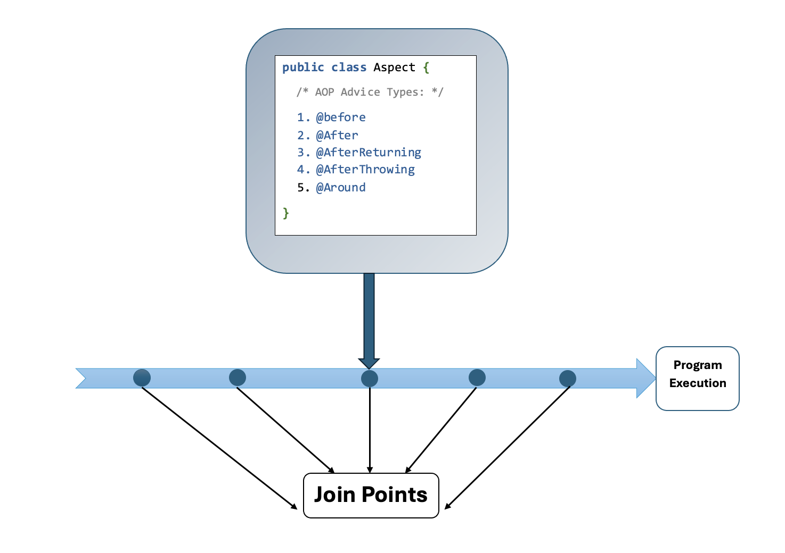
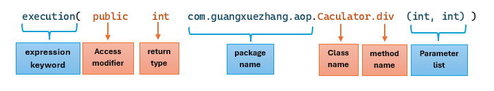

# Spring AOP Core Concepts
**Spring AOP (Aspect-Oriented Programming)** complements Object-oriented Programming
(OOP) by providing another way of thinking about program structure.

The key unit of modularity in OOP is class, whereas in AOP the unit of modularity
is the aspect. Aspects enable the modularization of concerns(such as logging, transaction
management, security, etc.) that cut across multiple types and objects.
(Such concerns often termed "cross-cutting" concerns in AOP literature).

The powerful feature of the Spring Framework that allows developers to add
cross-cutting concerns(such as logging, transaction management, security, etc.)
to their application **without modifying the actual business logic.**

## Spring AOP Use Cases
### 1. Logging
AOP can be used to log method entry, exit and exceptions across various layers of
an application without cluttering the business logic with logging code.
https://github.com/guangxue/SpringCoreEssentials/blob/585541781ab2e8ccbb36b1e41f55e338e0c79f7d/04_AOP/src/main/java/com/guangxuezhang/aop/logging/aspect/LoggingAspect.java#L9-L22

### 2. Transaction Management
AOP can manage transactions declaratively, ensuring that business methods are
executed within a transactional context without manually managing transaction
boundaries.

### 3. Security
AOP can be used to enforce security constrains by checking permissions before
executing a method.

### 4. Performance Monitoring
AOP can measure the performance of methods by recording execution time,helping
identify bottlenecks in the application.

### 5. Exception Handling
AOP can centralize exception handling by applying consistent error handling
policies across multiple methods.

### 6. Caching
AOP can be used to implement caching, allowing frequently accessed data to be
stored and retrieved quickly.

### 7. Audit Logging
AOP can automate the recording of audit logs for critical actions in the application,
ensuring compliance and traceability.

## Aspect Oriented Programming Core Concepts
Before we dive into the implementation of Spring AOP implementation,
we should understand the core concepts of AOP.

1. **Aspect**: An aspect is a class that implements enterprise application concerns
that cut across multiple classes, such as transaction management. Aspect can be a
normal class configured through Spring XML configuration, or we can use
AspectJ integration to define a class as Aspect using `@Aspect` annotation.
2. **Join Point**: A join point is a specific point in the application 
such as `method execution`, `exception handling`, `changing object variable values`etc.
in Spring AOP a join point is always the execution of method.
3. **Advice**: Advices are taken for a particular join point. In terms of programming,
they are methods that get executed when a certain join point with matching pointcut is
reached in the application.
4. **Pointcut**: Pointcut is expressions that match with join points to determine whether
advice needs to be executed or not. Pointcut uses different kinds of expressions
that are matched with the join points and Spring framework uses the AspectJ pointcut expression language.
5. **Target Object**: They are the object on which advices are applied.
Spring AOP is implemented using runtime proxies so this object is always a proxied
object.

## Pointcut Expression

**Expression keyword**: Pointcut expression starts with keyword: `execution`.

1. **Access modifier**: `public`,`private` or `protected`.
   - Use `*` means **any access modifier and any return types**.
2. **return type**: `String`,`int`,`void`etc.
   - Use `*` means either return type nor access modifier are needed.
   - It is invalid syntax to use `* String` or `public *`
3. **package name**: Same syntax as Java package name. 
   - Use `*..` means any packages under last specified package name.
4. **Class name**: The class name under the specified package name.
    - Specified package name: `com.guangxuezhang.aop`
    - Any packages: `com.guangxuezhang.*`
      - Use `*` means any packages under `guangxuezhang` package, also you can use `*Service` as any class name that 
      ends with `Service`.
    - Skip more packages: `com..guangxuezhang`.
      - Invalid to use `..` at the beginning of package, like this `..com.guangxuezhang`
5. **method name**: The method that will be executed at Join Points. `*` means any methods under specified package.
You can use `get*` as any method name that starts with `get`.
6. **Parameter list**: 
   - `()`: the method with no parameters.
   - `(..)`: the method with zero or more  parameter list.
   - `(String, ..)`: the method with parameters that first type is `String`.
   - `(..int)`: the method with parameters that last type is `int`.
   - `(String..int)`: the method with parameters that first is `String`, last is `int`.

## Combining Pointcut Expression
